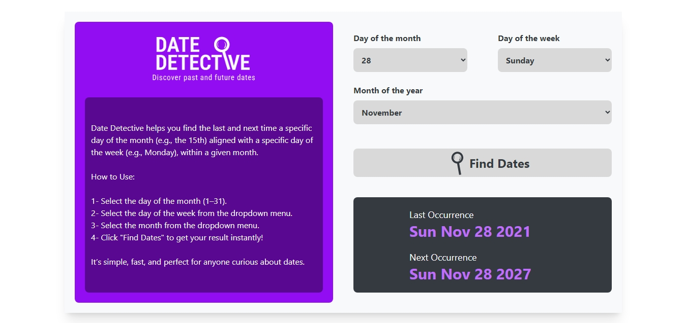

# Date Detective 🔍

A simple web application to help you understand dates better. This project aims to solve the common problem of determining when exactly a date occurred in the past or will occur in the future.

## Purpose

Date Detective was born from a personal need to easily track and understand dates. Whether you're planning future events or reminiscing about past ones, this tool helps you visualize and calculate dates with precision.

## Technologies Used

- Typescript
- React
- Vite
- Tailwind

## How to Use

1. Visit the website
2. Enter your date of interest
3. Click on "Find Dates"
4. Get instant results!

## Future Improvements

- Include calendar visualization

## Contributing

Feel free to contribute to this project by submitting issues or pull requests.
